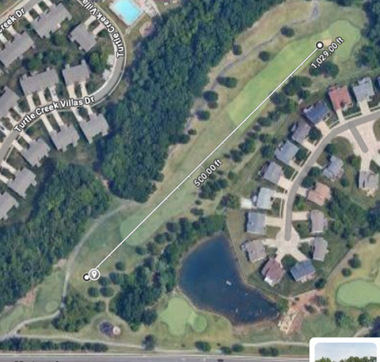

## Reggie Golf 

### Prep
- adjust the barrel
  - There's a support kept in Reggie's driver station bag that can be swapped in
    to go between the barrel plate and the frame w/ a carriage bolt. The one for T-shirts 
    results in about a 60 angle from the ground.  For golf, we want a much lower angle. 
  - In 2024, after lowering the plate to about 30 degrees, we further reduced the angle to about 23
    degrees using a stack of 3 2x4's to prop up Reggie's back side.
   
- locate the pieces
  - First slide the 3D printed part that fits inside the barrel in one of the barrels.   The flat side
    should be flush with the metal plate.
  - Take the Schedule 21 PVC barrel (Schedule 21 PVC inner diameter is slighly larger than a golf ball's outer diameter).
    and slide it inside the barrel, fitting it onto the 3D printed part already inside.
  - Slide the 2nd 3D printed part over the barrel and secure it with zip ties.
  - Ensure that there is a piece of gaffer's tape at the end of the barrel on the top side.   This creates 
    just a bit of spin on the ball as it leaves the barrel.  Be careful not to have any creases in the tape as that will ruin accuracy.

### Notes
  - In 2024, Reggie was positioned in the rough on the right side of the forward ladies' tee on Hole 18. 
  - We tried to keep about 90 PSI in the storage tank and fired with 80 PSI.
  - Some of the better shots traveled over 350 yards and were just short of the bunker in front of the green.
  - We increased the fire delay to about 3 seconds to allow the firing chambers to be more fully pressurized.

### What to bring
  - We brought tons of batteries, but only ended up using 2 the entire day.
  - Would be smart to bring basic electrical tools (wire strippers, small screwdrivers, wago connectors, tape, zip ties, etc.)
  - Bring some 2x4's to elevate or brace reggie as needed.

### Other stuff
  - We were set up on Hole 18 at the Falls Golf course.   This pic shows about where Reggie was and where our shots were landing
   
  - The deal was for $40, we'd fire a shot for a foursome.  We asked for the teams to supply us with one of their golf balls.
    They could either play the shot where it landed, or take a 
    drop by the 100 yard marker in the middle of the fairway.

### future ideas
  - Would be a cool thing to motorize the angle of the barrels.   The barrels are pretty heavy, but I suspect a gearbox 
    like the one we build for the 2023 Charged Up bot would probably do the trick.
  - We never tried to hit the green, but with 10 more PSI or so, it would seem like that could be possible.
  - Could get our own custom golf balls printed with maybe the Hat logo and 4329.  We could load up Reggie with 
    a ball and they'd get a little something to remember the team.  Looks like this place is pretty inexpensive: https://mycustomgolfball.com/collections/deals/products/taylormade-distance-golf-balls-double-dozen
