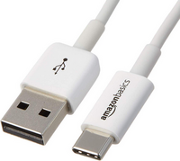

# How to run the REV client

The REV client ([download](https://docs.revrobotics.com/rev-hardware-client)) is extremely useful for many things including:
- assign IDs to Spark Max's
- Troubleshoot CAN issues
- Exercise Prototypes
- PID tuning

### Connecting to the Robot
connecting to the robot requires a USB-C connection - you probably want to pick a few of these up for connecting your 
laptop to either the PDH or a Spark Max.

If you'd like to control all motors on the robot, you'll need to disconnect the RIO from the CAN bus 
through a terminating resistor.  Use a 120 ohm resistor to connect the green and yellow wires that were connected to the RIO. 
its kinda handy to have a break in the wires leaving the RIO (connected via wago connector) to make it easy to swap in a resitor whenever you need.
If the REV client detects a RIO on the CAN network, it will not control any of the motors. 

### Motor configuration
You can use the REV client for nearly everything in regards to configuring and running REV motors and encoders.
You'll see all the devices on the CAN network on the left hand side.   If you are not seeing a sparkmax you expect to see
that's a likely indication that there's a CAN wiring problem.   Usually starting at the last sparkmax that is detected is a
good starting point to locate where the break in the CAN loop is.

### Motor testing
The REV client is very useful in testing motors or off-robot assemblies.  You can use it to control motors with respect to velocity or position
and can even control multiple motors at the same time.